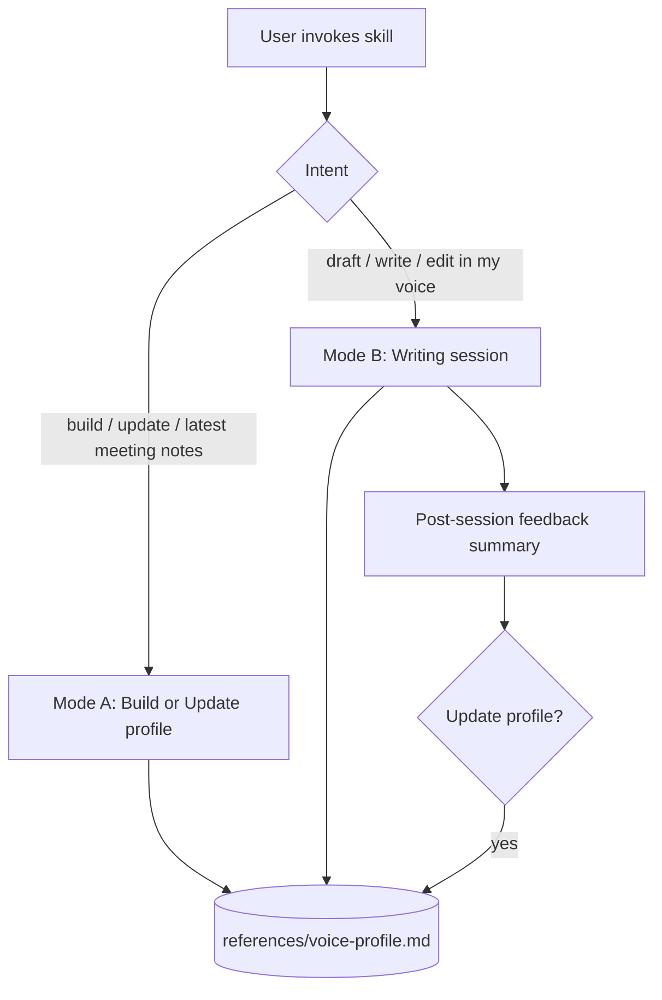

# Voice Profile Generator

A living voice profile manager. Sources meeting transcripts from any available transcription tool (Granola, Fireflies, Otter, Fathom, Read.ai, tl;dv, Grain, Zoom, Google Meet, Microsoft Teams) plus any pasted, attached, or folder-based material, maintains one canonical profile file inside this skill, and uses it to drive writing sessions with a post-session feedback loop that keeps the profile sharp over time.

## The single source of truth

The profile lives at:

```
references/voice-profile.md
```

Everything this skill does reads from, writes to, or merges into that one file. It is created on the first build and updated in place from then on. Format and merge rules are in [`references/profile-format.md`](references/profile-format.md).

## Two modes — pick one based on intent



### Mode A — Build or Update the profile

Use when the user asks to build, refresh, update, or "get the latest meeting notes into" their profile. Also use the first time Mode B is requested and `references/voice-profile.md` does not yet exist.

1. **Collect sources.** Read [`references/source-ingestion.md`](references/source-ingestion.md). Detect available meeting transcript providers at runtime; consult [`references/transcript-providers.md`](references/transcript-providers.md) for per-provider adapter notes only when you need to wire a specific one. Paste/file/folder ingestion is the documented fallback when no provider is available, and a useful supplement for polished writing samples no transcription tool will ever have. On an update, only pull material newer than each provider's recorded `last_synced` and dedupe against prior sources.
2. **Analyze the new material.** Read [`references/analysis-framework.md`](references/analysis-framework.md). Work the seven dimensions. On updates, follow the "Incremental updates" note: analyze only the new material and merge into existing dimensions rather than starting from scratch.
3. **Write or merge the profile.** Read [`references/profile-format.md`](references/profile-format.md). On a first build, create `references/voice-profile.md` from the template. On updates, refine and add evidence — do not wipe prior findings unless directly contradicted — raise confidence as volume grows, bump the relevant per-provider `last_synced`, and append a changelog entry.
4. **Confirm.** Tell the user what changed (providers pulled from, dimensions touched, new evidence added, confidence raised), where the profile lives, and how to trigger Mode B.

### Mode B — Writing session

Use when the user asks to draft, write, or edit something in their voice. Read [`references/writing-session.md`](references/writing-session.md) for the full loop. The shape is:

1. Read `references/voice-profile.md`. If it does not exist, switch to Mode A first.
2. Draft using the profile. Run the in-profile self-review checklist before presenting.
3. Iterate with the user (edits, rewrites, alternative versions).
4. **Post-Session Feedback Summary.** Once the user is done (they accept a draft, ship it, or end the session), present a short summary of the feedback they gave and the editing choices that were made, mapped to voice dimensions where possible.
5. Ask: *"Want me to update your voice profile with these signals?"* On yes, apply targeted edits to `references/voice-profile.md` and append a changelog entry. On no, do nothing — the profile is unchanged.

The user can also say at any point inside Mode B: *"update my profile with that"* or *"add this to my voice profile"* — apply the edits immediately, no separate Mode A run needed.

## Reference files

- [source-ingestion.md](references/source-ingestion.md) — Mode A, step 1 (transcript providers + paste/file/folder fallback)
- [transcript-providers.md](references/transcript-providers.md) — Per-provider adapter notes, loaded only when wiring a specific provider
- [analysis-framework.md](references/analysis-framework.md) — Mode A, step 2 (seven-dimension framework + incremental-update note)
- [profile-format.md](references/profile-format.md) — Mode A, step 3 (living profile structure, merge rules, quality gate)
- [writing-session.md](references/writing-session.md) — Mode B (draft, feedback summary, in-place updates)

## Rules

- `references/voice-profile.md` is the single source of truth. Never produce a parallel "portable prompt" file or a zipped skill — the living profile replaces both.
- Every voice trait must trace to a verbatim quote from the source material (any transcript, pasted text, or a captured in-session correction).
- The skill knows what a transcript is, not which app produced it. Treat any meeting transcription tool as a transcript-source provider with `list_since(timestamp)` + `fetch(id)` semantics. Per-provider details live in `references/transcript-providers.md` and load only on demand.
- Updates merge, they do not overwrite. Prior evidence stays unless the new material directly contradicts it; the changelog records every change.
- Load one reference file per step. Do not bulk-load all references at activation.
- Minimum ~2,000 cumulative words of source material for a high-confidence profile. Below that, proceed when asked and flag low-confidence dimensions explicitly in the profile.
- No transcript provider is a hard dependency. If none are detected, fall back to paste/file/folder ingestion and tell the user.
- Never invent traits to fill thin sections — flag low confidence inside that section instead.
